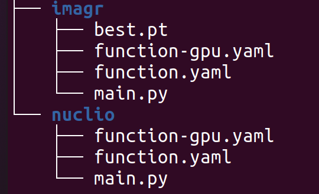
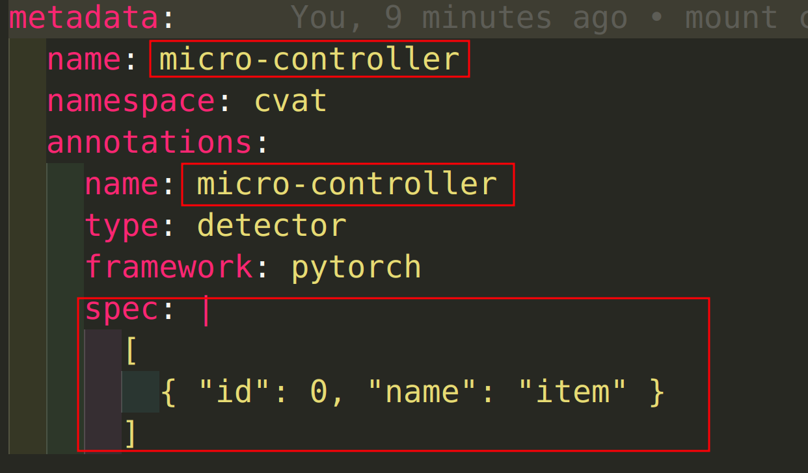

# Install 

https://opencv.github.io/cvat/docs/administration/basics/installation/

Export ip 

```bash
ifconfig
export CVAT_HOST=192.168.178.47
```

to run 

```bash
docker compose -f docker-compose.yml -f components/serverless/docker-compose.serverless.yml up -d
# add --build for changing docker-compose.yml
docker compose -f docker-compose-mount.yml -f components/serverless/docker-compose.serverless.yml up -d
```

to stop 

```bash
docker compose -f docker-compose-mount.yml -f components/serverless/docker-compose.serverless.yml down
```


# Auto-anno Yolo v5

https://opencv.github.io/cvat/docs/administration/advanced/installation_automatic_annotation/

create another dir for new Auto-Label model 



in `main.py`

```python 
# load the custom model like this 
model = model = torch.hub.load('ultralytics/yolov5', 'custom', path='./best.pt', force_reload=True)
```

in `function-gpu.yaml`

chaneg name and spec



to deploy

```bash
nuctl deploy --project-name cvat \
  --path serverless/pytorch/ultralytics/yolov5/imagr \
  --platform local \
  --file serverless/pytorch/ultralytics/yolov5/imagr/function-gpu.yaml
```

# Mount local dir 

https://opencv.github.io/cvat/docs/administration/basics/installation/#share-path


# Serverless 

https://opencv.github.io/cvat/docs/manual/advanced/serverless-tutorial/
